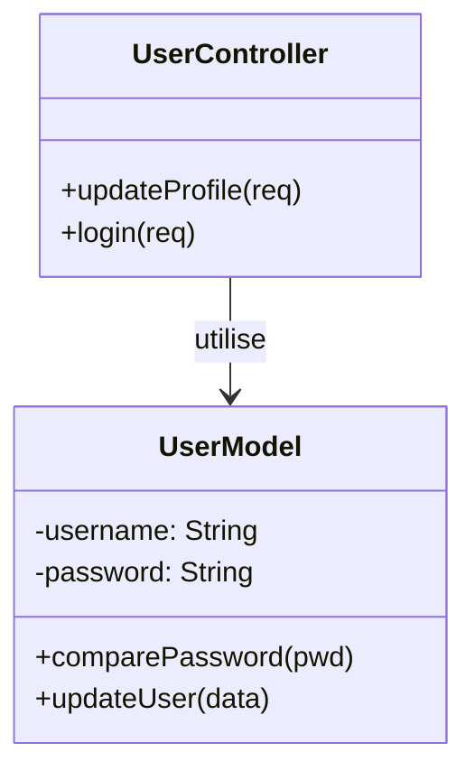
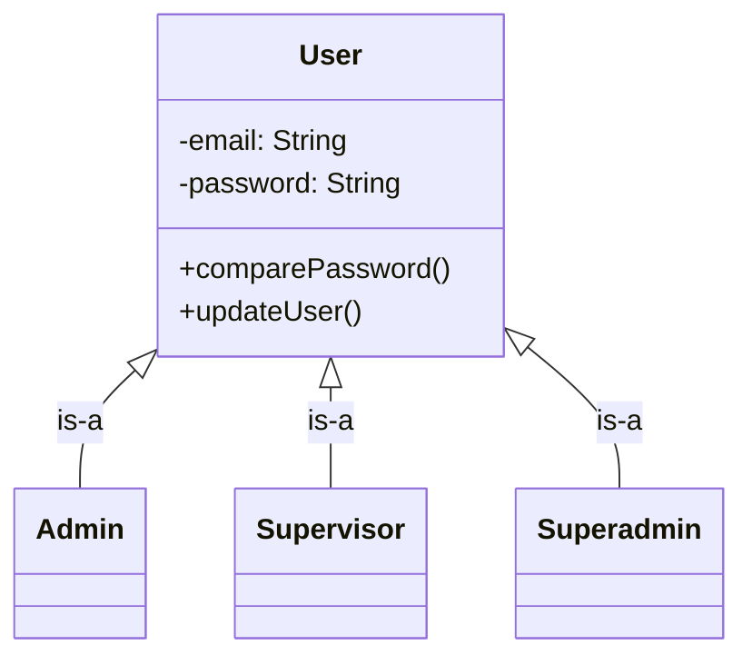
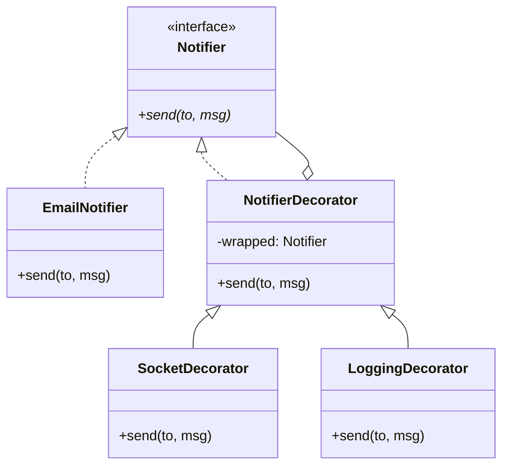
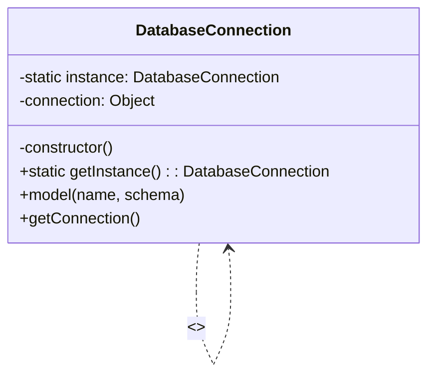
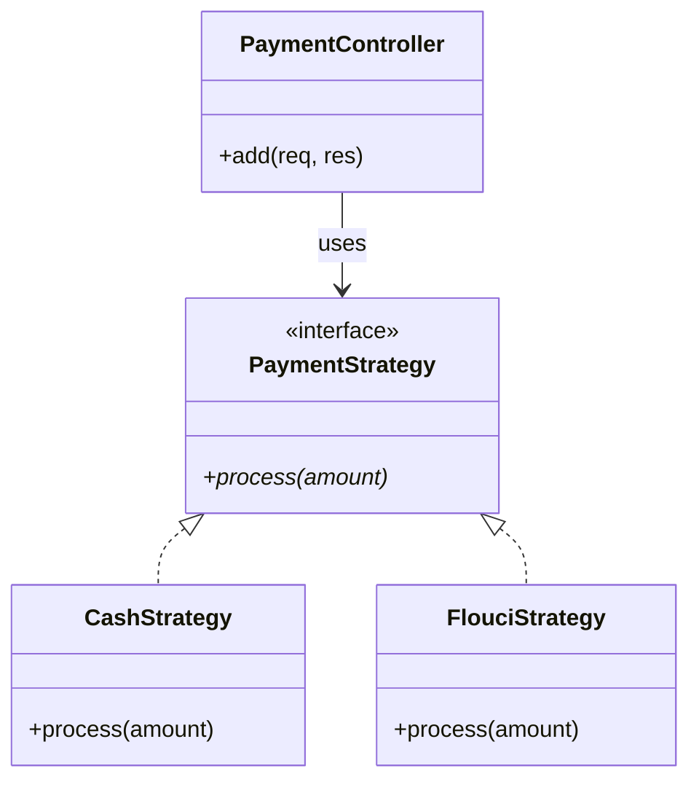

# Rapport Complet – Implémentation des Patterns GRASP, SOLID et GoF  
## Projet Backend_PFE_GL

---

## 1. Introduction

Ce rapport présente l’intégration de plusieurs principes et patrons de conception dans le backend d’une application de gestion de parking et de paiements. L’objectif est d’améliorer la maintenabilité, la flexibilité et la robustesse du code.

Les concepts implémentés sont :

- **GRASP – Information Expert**  
- **SOLID – Liskov Substitution Principle (LSP)**  
- **Patrons GoF : Decorator, Singleton, Strategy**

Chaque section inclut une problématique, une solution UML, des extraits de code et les bénéfices obtenus.

---

## 2. GRASP – Information Expert

### 2.1 Problématique

Les contrôleurs contenaient trop de logique métier (vérification de mot de passe, mise à jour de profil), ce qui violait l’encapsulation et causait de la duplication de code.

### 2.2 Solution

Déplacer la responsabilité vers le modèle qui possède les données nécessaires.

### 2.3 Diagramme UML simplifié



### 2.4 Extrait de code

```javascript
// Modèle User (Mongoose)
userSchema.methods.comparePassword = async function(userPassword) {
  return await bcrypt.compare(userPassword, this.password);
};

// Contrôleur
const isValid = await user.comparePassword(req.body.password);
```

### 2.5 Bénéfices

- Encapsulation renforcée  
- Haute cohésion  
- Faible couplage  
- Réutilisabilité des méthodes métier

---

## 3. SOLID – Liskov Substitution Principle (LSP)

### 3.1 Problématique

Trois modèles séparés (Admin, Supervisor, User) avec logique d’authentification dupliquée, requêtes multiples pour un simple login.

### 3.2 Solution

Utilisation d’un modèle unique `User` avec discriminateurs Mongoose.

### 3.3 Diagramme UML



### 3.4 Extrait de code

```javascript
const userSchema = new Schema({ ... }, {
  discriminatorKey: 'role',
  collection: 'users'
});

const Supervisor = User.discriminator('Supervisor', supervisorSchema);
```

### 3.5 Bénéfices

- Authentification centralisée  
- Code réutilisé (hachage, hooks)  
- Interchangeabilité des sous-types  
- Maintenance simplifiée

---

## 4. Patron Decorator – Notifications dynamiques

### 4.1 Problématique

Ajouter des fonctionnalités (email, socket, log) sans exploser le nombre de classes via l’héritage.

### 4.2 Solution

Utilisation du Decorator pour empiler dynamiquement des comportements.

### 4.3 Diagramme UML



### 4.4 Extrait de code

```javascript
let notification = new EmailNotifier();
notification = new SocketDecorator(notification, io);
notification = new LoggingDecorator(notification);

await notification.send(user, 'Succès');
```

### 4.5 Bénéfices

- Respect du SRP  
- Flexibilité totale  
- Code sans `if/else` complexes

---

## 5. Patron Singleton – Connexion MongoDB

### 5.1 Problématique

Multiples connexions à MongoDB risquant de saturer les ressources.

### 5.2 Solution

Une instance unique et globalement accessible.

### 5.3 Diagramme UML



### 5.4 Extrait de code

```javascript
static getInstance() {
  if (!DatabaseConnection.#instance) {
    DatabaseConnection.#instance = new DatabaseConnection();
    DatabaseConnection.#instance._connect();
  }
  return DatabaseConnection.#instance;
}
```

### 5.5 Bénéfices

- Instance unique garantie  
- Logique centralisée  
- Évite les fuites mémoire

---

## 6. Patron Strategy – Modes de paiement

### 6.1 Problématique

Logique conditionnelle massive pour gérer plusieurs modes de paiement (cash, Flouci).

### 6.2 Solution

Encapsulation de chaque algorithme dans une stratégie interchangeable.

### 6.3 Diagramme UML



### 6.4 Extrait de code

```javascript
const strategy = method === 'cash'
  ? new CashPaymentStrategy()
  : new FlouciPaymentStrategy();

const result = await strategy.process(amount);
```

### 6.5 Bénéfices

- Principe Open/Closed respecté  
- Évolutivité (ajout facile de PayPal, Stripe)  
- Tests unitaires simplifiés  
- Contrôleur allégé

---

## 7. Conclusion globale

L’application combine efficacement :

| Catégorie       | Pattern / Principe       | Rôle principal                          |
|----------------|--------------------------|------------------------------------------|
| GRASP          | Information Expert       | Logique métier dans les modèles          |
| SOLID          | Liskov Substitution      | Hiérarchie d’utilisateurs interchangeable|
| GoF (structure) | Decorator                | Ajout dynamique de comportements         |
| GoF (création)  | Singleton                | Gestion unique de connexion DB           |
| GoF (comportement) | Strategy               | Algorithmes de paiement interchangeables |

Cette architecture garantit un backend **maintenable**, **testable** et **évolutif** pour le projet *Backend_PFE_GL*.
